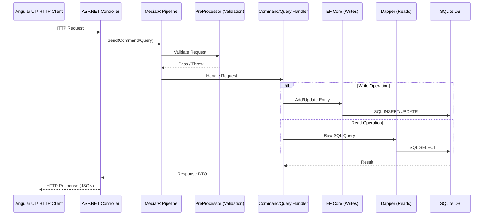

# ARCHITECTURE.md — Stargate ACTS

> **Persona**: I am the **Architecture Agent** — a senior solutions architect embedded in this monorepo. My job is to map the system's structure, enforce design patterns, identify anti-patterns, and guide all downstream agents (Frontend, Backend, Testing, DevOps) toward a cohesive, production-quality implementation. I evaluate every change against the domain rules defined in [SPEC.md](file:///c:/Users/herre/source/technical-exercise/tech_exercise_v.0.0.4/tech_exercise/package/exercise1/SPEC.md) and the patterns documented below.

---

## 1. Project Structure Map (Current — Post Restructure)

```
tech_exercise/                                # Git repo root
├── .gitignore                             # Repo-wide ignores (bin/, obj/, node_modules/, *.db)
exercise1/                                  # Monorepo root
├── README.md                              # ACTS requirements & rules (original)
├── SPEC.md                                # Business specification
├── ARCHITECTURE.md                        # This document
├── CHECKLIST.md                           # Action plan
├── docker-compose.yml                     # Service orchestration
├── .gitignore                             # Repo-wide ignores
├── agents/                                # SDD Agent blueprints
│   ├── BACKEND_API.md
│   ├── FRONTEND_ANGULAR.md
│   ├── TESTING.md
│   ├── DEVOPS_DOCKER.md
│   ├── DOCUMENTATION.md
│   └── QA.md
├── src/
│   ├── api/                               # .NET 8 Web API
│   │   ├── Dockerfile                     # Multi-stage .NET build
│   │   ├── .dockerignore
│   │   ├── entrypoint.sh                  # Container startup + migrations
│   │   ├── Program.cs                     # Minimal hosting entry point
│   │   ├── StargateAPI.csproj             # Project file & NuGet deps
│   │   ├── appsettings.json               # SQLite connection string
│   │   ├── appsettings.Development.json
│   │   ├── Properties/
│   │   │   └── launchSettings.json
│   │   ├── Controllers/
│   │   │   ├── PersonController.cs
│   │   │   ├── AstronautDutyController.cs
│   │   │   ├── BaseResponse.cs
│   │   │   └── ControllerBaseExtensions.cs
│   │   ├── Middleware/                    # Phase 3
│   │   │   └── GlobalExceptionMiddleware.cs
│   │   └── Business/
│   │       ├── Behaviors/                 # Phase 3
│   │       │   └── ValidationBehavior.cs  # MediatR + FluentValidation pipeline
│   │       ├── Validators/                # Phase 3
│   │       │   ├── CreatePersonValidator.cs
│   │       │   └── CreateAstronautDutyValidator.cs
│   │       ├── Commands/
│   │       │   ├── CreatePerson.cs
│   │       │   └── CreateAstronautDuty.cs
│   │       ├── Queries/
│   │       │   ├── GetPeople.cs
│   │       │   ├── GetPersonByName.cs
│   │       │   └── GetAstronautDutiesByName.cs
│   │       ├── Data/
│   │       │   ├── IStargateContext.cs     # Phase 3 — testability interface
│   │       │   ├── StargateContext.cs
│   │       │   ├── Person.cs              # + R1 unique index (Phase 2)
│   │       │   ├── AstronautDetail.cs
│   │       │   └── AstronautDuty.cs
│   │       ├── Dtos/
│   │       │   └── PersonAstronaut.cs
│   │       └── Migrations/
│   │           ├── 20240122..._InitialCreate.cs
│   │           └── 20260222..._AddPersonNameUniqueIndex.cs
│   └── ui/                                # Angular Application (Phase 6)
│       ├── Dockerfile                     # Multi-stage Angular + Nginx
│       ├── .dockerignore
│       ├── nginx.conf                     # SPA routing + API proxy
│       └── README.md                      # Scaffold instructions
├── tests/
│   └── StargateAPI.Tests/                 # xUnit test project (Phase 5)
│       └── README.md                      # Scaffold instructions
├── scripts/
│   ├── init-db.sh                         # Database initialization
│   └── run-tests.sh                       # Test runner with coverage
└── docs/                                  # Supplementary docs (Phase 8)
```

---

## 2. Design Patterns Identified

### 2.1 Patterns Present ✅

| Pattern | Implementation | Files |
|---|---|---|
| **CQRS** (Command Query Responsibility Segregation) | Commands and Queries are separated into distinct classes. Commands mutate state; Queries are read-only. | `Business/Commands/`, `Business/Queries/` |
| **Mediator** | MediatR dispatches all Commands/Queries, decoupling Controllers from business logic. | `Program.cs`, all Controllers |
| **Request Pre-Processing** | MediatR `IRequestPreProcessor` validates requests *before* the Handler executes. | `CreatePersonPreProcessor`, `CreateAstronautDutyPreProcessor` |
| **Repository (Implicit)** | `StargateContext` acts as both Unit of Work and Repository via EF Core `DbSet<T>`. | `StargateContext.cs` |
| **DTO Projection** | `PersonAstronaut` DTO decouples the read model from the entity model. | `PersonAstronaut.cs`, Query Handlers |
| **Entity Configuration** (Fluent API) | Each entity has a co-located `IEntityTypeConfiguration` class. | `Person.cs`, `AstronautDetail.cs`, `AstronautDuty.cs` |

### 2.2 Patterns Missing / Anti-Patterns ⚠️

| Issue | Description | Recommendation |
|---|---|---|
| **No Logging** | Zero structured logging. No exception capture, no success auditing, no DB log sink. | Add `ILogger<T>` injection + Serilog DB sink. Add `RequestLog` entity. |
| **No Validation Layer** | Validation exists only in PreProcessors via exceptions. No FluentValidation or data annotations. | Introduce `FluentValidation` pipeline behavior in MediatR. |
| **No Unit Tests** | Zero test projects or test files exist in the repository. | Add `StargateAPI.Tests` xUnit project. |
| **No Error Middleware** | Each controller catches exceptions independently. No global exception handler. | Add `UseExceptionHandler` or a custom middleware. |
| **SQL Injection Vulnerability** | Dapper queries use string interpolation (`$"... '{request.Name}' ..."`) instead of parameterized queries. | Use `@Name` parameters: `WHERE @Name = a.Name`, passing `new { request.Name }`. |
| **Dual ORM Without Clear Boundary** | Both EF Core and Dapper are used in the same handlers without clear separation of concerns. | Convention: EF Core for writes, Dapper for reads. Document this explicitly. |
| **No CORS Configuration** | API has no CORS policy. A frontend (Angular) will fail to connect. | Add `builder.Services.AddCors()` with frontend origin. |
| **No Repository Abstraction** | Handlers directly depend on `StargateContext`, making them hard to test. | Introduce `IStargateContext` or repository interfaces. |

---

## 3. Known Bugs (Code Review Findings)

> [!NOTE]
> All 5 bugs identified during code review have been **RESOLVED** in Phase 1. Each fix is annotated with a `// BUG-N FIX:` comment in the source code.

### BUG-1: Wrong Query in AstronautDutyController.GET — ✅ RESOLVED

**File**: [AstronautDutyController.cs](file:///c:/Users/herre/source/technical-exercise/tech_exercise_v.0.0.4/tech_exercise/package/exercise1/src/api/Controllers/AstronautDutyController.cs#L25)

The `GetAstronautDutiesByName` action dispatches `GetPersonByName` instead of `GetAstronautDutiesByName`:

```diff
- var result = await _mediator.Send(new GetPersonByName()
+ var result = await _mediator.Send(new GetAstronautDutiesByName()
```

### BUG-2: SQL Injection in Dapper Queries — ✅ RESOLVED

**Files**: `src/api/Business/Commands/CreateAstronautDuty.cs`, `src/api/Business/Queries/GetPersonByName.cs`, `src/api/Business/Queries/GetAstronautDutiesByName.cs`

All Dapper queries use string interpolation, enabling SQL injection:

```diff
- var query = $"SELECT * FROM [Person] WHERE '{request.Name}' = Name";
+ var query = "SELECT * FROM [Person] WHERE @Name = Name";
- var person = await _context.Connection.QueryFirstOrDefaultAsync<Person>(query);
+ var person = await _context.Connection.QueryFirstOrDefaultAsync<Person>(query, new { request.Name });
```

### BUG-3: CareerEndDate Logic Inconsistency — ✅ RESOLVED

**File**: [CreateAstronautDuty.cs](file:///c:/Users/herre/source/technical-exercise/tech_exercise_v.0.0.4/tech_exercise/package/exercise1/src/api/Business/Commands/CreateAstronautDuty.cs#L78)

When a *new* astronaut retires (no prior `AstronautDetail`), `CareerEndDate` is set to `DutyStartDate`. But per **Rule R7**, it should be set to `DutyStartDate - 1 day`:

```diff
  if (request.DutyTitle == "RETIRED")
  {
-     astronautDetail.CareerEndDate = request.DutyStartDate.Date;
+     astronautDetail.CareerEndDate = request.DutyStartDate.AddDays(-1).Date;
  }
```

### BUG-4: Missing Error Handling in AstronautDutyController.POST — ✅ RESOLVED

**File**: [AstronautDutyController.cs](file:///c:/Users/herre/source/technical-exercise/tech_exercise_v.0.0.4/tech_exercise/package/exercise1/src/api/Controllers/AstronautDutyController.cs#L49)

The `CreateAstronautDuty` POST action has no try-catch, unlike every other action. An unhandled exception will return a 500 with a stack trace.

### BUG-5: Null Reference Risk in GetAstronautDutiesByName — ✅ RESOLVED

**File**: [GetAstronautDutiesByName.cs](file:///c:/Users/herre/source/technical-exercise/tech_exercise_v.0.0.4/tech_exercise/package/exercise1/src/api/Business/Queries/GetAstronautDutiesByName.cs#L37)

If `person` is `null` (name not found), `person.PersonId` on line 34 will throw a `NullReferenceException`.

---

## 4. Architectural Flow



---

## 5. Target Monorepo Structure

```
stargate-acts/
├── docker-compose.yml
├── .gitignore
├── README.md
├── SPEC.md
├── ARCHITECTURE.md
├── CHECKLIST.md
├── agents/                          # SDD Agent blueprints
│   ├── FRONTEND_ANGULAR.md
│   ├── BACKEND_API.md
│   ├── TESTING.md
│   ├── DEVOPS_DOCKER.md
│   ├── DOCUMENTATION.md
│   └── QA.md
├── src/
│   ├── api/                         # .NET 8 Web API
│   │   ├── Dockerfile
│   │   ├── StargateAPI.csproj
│   │   ├── Program.cs
│   │   ├── Controllers/
│   │   ├── Business/
│   │   └── ...
│   └── ui/                          # Angular Application
│       ├── Dockerfile
│       ├── angular.json
│       ├── package.json
│       └── src/
├── tests/
│   └── StargateAPI.Tests/
│       ├── StargateAPI.Tests.csproj
│       └── ...
└── scripts/
    ├── init-db.sh
    └── run-tests.sh
```

---

## 6. Architectural Decisions

| Decision | Rationale |
|---|---|
| **Keep CQRS + MediatR** | The pattern is already established and fits the domain well. Extend, don't replace. |
| **EF Core for writes, Dapper for reads** | Formalize the existing dual-ORM approach as an explicit convention. |
| **Add FluentValidation via MediatR behaviors** | Replaces ad-hoc exception throwing with a declarative, testable validation pipeline. |
| **Global exception middleware** | Centralizes error handling, removes try-catch duplication from controllers. |
| **Serilog with SQLite sink** | Fulfills the "store logs in database" requirement with minimal friction. |
| **Parameterized Dapper queries** | Mandatory security fix. Non-negotiable. |
| **Angular for frontend** | Explicitly preferred in the README requirements. |
| **Docker Compose for orchestration** | Enables single-command launch of API + UI + DB generation. |
