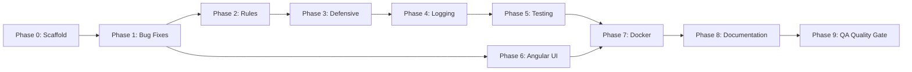

# CHECKLIST.md — Stargate ACTS Action Plan

> **Spec Driven Development Execution Checklist**
> Governed by: [SPEC.md](file:///c:/Users/herre/source/technical-exercise/tech_exercise_v.0.0.4/tech_exercise/package/exercise1/SPEC.md) · [ARCHITECTURE.md](file:///c:/Users/herre/source/technical-exercise/tech_exercise_v.0.0.4/tech_exercise/package/exercise1/ARCHITECTURE.md)

---

## Phase 0: Monorepo & SDD Scaffold

- [x] **0.1** Restructure repo into monorepo layout (see ARCHITECTURE.md §1)
- [x] **0.2** Create `agents/` directory with agent blueprints:
  - [x] `agents/BACKEND_API.md` — API bug fixes, rule enforcement, defensive coding
  - [x] `agents/FRONTEND_ANGULAR.md` — Angular UI scaffolding and implementation
  - [x] `agents/TESTING.md` — Unit test strategy, coverage targets, test harness
  - [x] `agents/DEVOPS_DOCKER.md` — Dockerfile, docker-compose, CI/CD readiness
  - [x] `agents/DOCUMENTATION.md` — Documentation standards, API docs, README generation
  - [x] `agents/QA.md` — Quality assurance checks, regression validation, acceptance criteria
- [x] **0.3** SPEC.md, ARCHITECTURE.md, CHECKLIST.md at monorepo root

---

## Phase 1: Bug Fixes (from ARCHITECTURE.md §3)

- [x] **1.1** Fix BUG-1: `AstronautDutyController.GET` dispatches wrong query
  - Change `GetPersonByName` → `GetAstronautDutiesByName`
- [x] **1.2** Fix BUG-2: SQL injection in all Dapper queries
  - Parameterize every query in `CreateAstronautDuty`, `GetPersonByName`, `GetAstronautDutiesByName`, `GetPeople`
- [x] **1.3** Fix BUG-3: `CareerEndDate` set incorrectly for new retired astronauts
  - Apply `AddDays(-1)` per Rule R7
- [x] **1.4** Fix BUG-4: Missing try-catch in `AstronautDutyController.POST`
- [x] **1.5** Fix BUG-5: Null reference in `GetAstronautDutiesByName` when person not found

---

## Phase 2: Rule Enforcement (SPEC.md §3)

- [ ] **2.1** R1 — Enforce Person name uniqueness (DB constraint + validation)
- [ ] **2.2** R2 — Ensure no Astronaut records exist for non-assigned people
- [ ] **2.3** R3 — Validate only one current duty at a time
- [ ] **2.4** R4 — Ensure current duty has null `DutyEndDate`
- [ ] **2.5** R5 — Previous duty end date = new start date − 1 day
- [ ] **2.6** R6 — `RETIRED` title sets retirement status
- [ ] **2.7** R7 — Career end date = retired start date − 1 day

---

## Phase 3: Defensive Coding & Architecture Improvements

- [ ] **3.1** Add global exception handling middleware
- [ ] **3.2** Introduce FluentValidation via MediatR pipeline behavior
- [ ] **3.3** Add input validation (null checks, string length, date validation)
- [ ] **3.4** Add CORS configuration for Angular frontend
- [ ] **3.5** Introduce `IStargateContext` interface for testability
- [ ] **3.6** Formalize EF Core (writes) / Dapper (reads) convention

---

## Phase 4: Process Logging (Task T5)

- [ ] **4.1** Create `RequestLog` entity and DB migration
- [ ] **4.2** Configure `ILogger<T>` in all handlers and controllers
- [ ] **4.3** Add Serilog with SQLite sink (or custom DB logger)
- [ ] **4.4** Log all exceptions with stack trace and request context
- [ ] **4.5** Log all successful operations with operation type and entity ID
- [ ] **4.6** Add `/logs` endpoint for querying stored logs (stretch)

---

## Phase 5: Unit Testing (Task T4)

- [ ] **5.1** Create `tests/StargateAPI.Tests/` xUnit project
- [ ] **5.2** Add test infrastructure (Moq, in-memory SQLite, test fixtures)
- [ ] **5.3** Write tests for highest-impact methods:
  - [ ] `CreateAstronautDutyHandler` — all 7 rules exercised
  - [ ] `CreateAstronautDutyPreProcessor` — validation paths
  - [ ] `CreatePersonHandler` — duplicate name rejection
  - [ ] `GetAstronautDutiesByNameHandler` — null person, valid person
  - [ ] `GetPeopleHandler` — empty DB, populated DB
- [ ] **5.4** Achieve >50% code coverage
- [ ] **5.5** Add coverage report generation to build pipeline

---

## Phase 6: Frontend — Angular UI (Tasks UI-1 to UI-3)

- [ ] **6.1** Scaffold Angular project in `src/ui/`
- [ ] **6.2** Create core services:
  - [ ] `PersonService` — calls `/Person` endpoints
  - [ ] `AstronautDutyService` — calls `/AstronautDuty` endpoints
- [ ] **6.3** Create components:
  - [ ] `PeopleListComponent` — displays all people
  - [ ] `PersonDetailComponent` — displays person + astronaut info
  - [ ] `DutyHistoryComponent` — displays duty timeline
  - [ ] `AddDutyFormComponent` — form to add new astronaut duty
- [ ] **6.4** Implement loading states, error states, and progress indicators
- [ ] **6.5** Apply production-quality styling (Angular Material or Tailwind)
- [ ] **6.6** Add routing: `/people`, `/people/:name`, `/duties/:name`

---

## Phase 7: Docker & Deployment

- [ ] **7.1** Create `src/api/Dockerfile` (multi-stage .NET build)
- [ ] **7.2** Create `src/ui/Dockerfile` (multi-stage Angular build + Nginx)
- [ ] **7.3** Create `docker-compose.yml` orchestrating API + UI
- [ ] **7.4** Database auto-generation on container startup (EF migrations)
- [ ] **7.5** Health check endpoints
- [ ] **7.6** Environment variable configuration
- [ ] **7.7** Verify end-to-end launch: `docker-compose up`

---

## Phase 8: Documentation (Post-Implementation)

- [ ] **8.1** Generate API documentation (Swagger/OpenAPI export)
- [ ] **8.2** Write developer onboarding guide (`docs/ONBOARDING.md`)
- [ ] **8.3** Document all architectural decisions and conventions
- [ ] **8.4** Create deployment runbook (`docs/DEPLOYMENT.md`)
- [ ] **8.5** Update root `README.md` with project overview, setup instructions, and usage
- [ ] **8.6** Add inline code documentation for all public methods and classes

---

## Phase 9: QA Quality Gate (Final Validation)

> Governed by: `agents/QA.md`

- [ ] **9.1** Verify all business rules (R1–R7) pass acceptance tests
- [ ] **9.2** Regression test all 5 API endpoints against SPEC.md §4.1
- [ ] **9.3** Validate bug fixes (BUG-1 through BUG-5) with targeted test cases
- [ ] **9.4** Confirm unit test coverage meets >50% threshold
- [ ] **9.5** Run SQL injection / security scan on all Dapper queries
- [ ] **9.6** Validate Angular UI meets UI-1, UI-2, UI-3 acceptance criteria
- [ ] **9.7** End-to-end Docker smoke test (`docker-compose up` → API health → UI loads)
- [ ] **9.8** Cross-reference CHECKLIST.md — all phases marked `[x]`
- [ ] **9.9** Final SPEC.md compliance audit — all acceptance criteria met

---

## Agent Deployment Strategy

Each phase maps to a specialized agent blueprint:

| Agent | Blueprint | Phases | Priority |
|---|---|---|---|
| **Backend API Agent** | `agents/BACKEND_API.md` | 1, 2, 3, 4 | 🔴 Critical |
| **Testing Agent** | `agents/TESTING.md` | 5 | 🟠 High |
| **Frontend Agent** | `agents/FRONTEND_ANGULAR.md` | 6 | 🟡 Medium |
| **DevOps Agent** | `agents/DEVOPS_DOCKER.md` | 0, 7 | 🟢 Standard |
| **Documentation Agent** | `agents/DOCUMENTATION.md` | 8 | 🟢 Standard |
| **QA Agent** | `agents/QA.md` | 9 | 🔴 Critical |

### Execution Order

> [!NOTE]
> **Phase 6 (Angular)** can begin in parallel with Phases 2–5 since the API contract (endpoints) is already defined. The backend and frontend can be developed concurrently against the SPEC.

> [!IMPORTANT]
> **Phase 9 (QA Quality Gate)** is the final gate. No deliverable is considered complete until Phase 9 passes. The QA Agent validates every prior phase against SPEC.md acceptance criteria.
