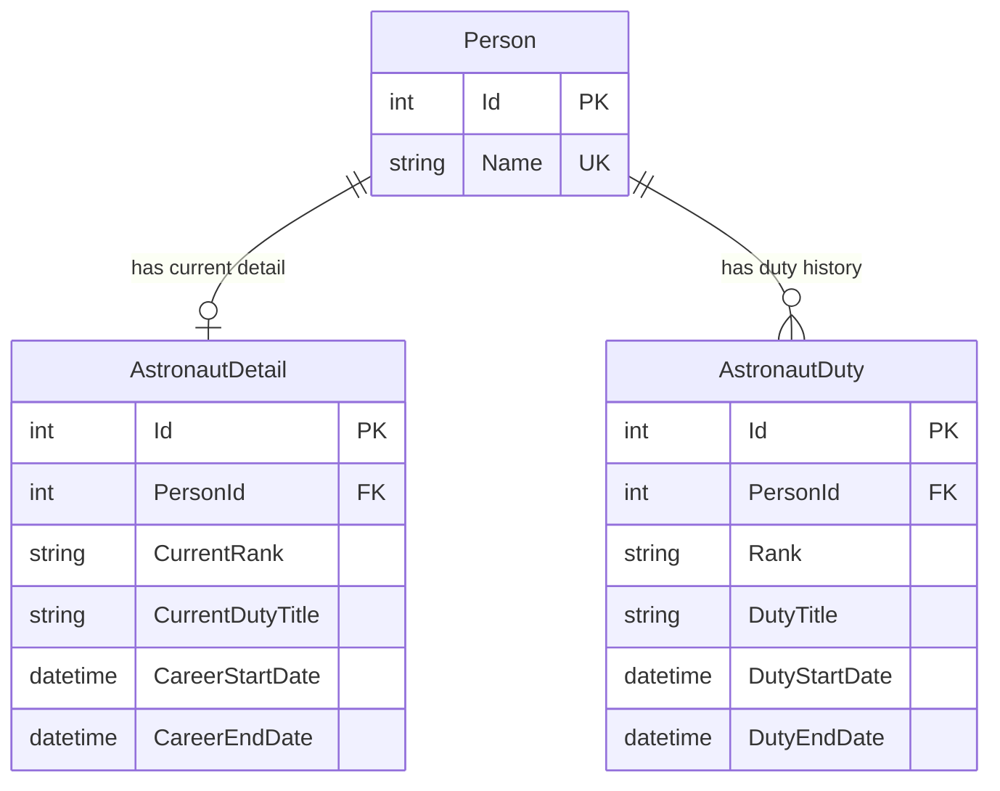

# SPEC.md — Stargate: Astronaut Career Tracking System (ACTS)

> **Spec Driven Development Artifact**
> Source of Truth: [README.md](file:///c:/Users/herre/source/technical-exercise/tech_exercise_v.0.0.4/tech_exercise/package/exercise1/README.md)
> Version: `v1.0.0`
> Last Updated: 2026-02-22

---

## 1. Project Overview

ACTS is a system that maintains a record of all People who have served as Astronauts. When a Person serves as an Astronaut, their **Duty** (Job) is tracked by **Rank**, **Title**, and **Start/End Dates**.

People in this system are not necessarily Astronauts. ACTS maintains a master list of *People* and *Duties* that are updated from an **external service** (not controlled by ACTS). The update schedule is determined by the external service.

---

## 2. Domain Model

### 2.1 Entities

| Entity | Description | Table |
|---|---|---|
| **Person** | An individual tracked in ACTS. Uniquely identified by `Name`. | `Person` |
| **AstronautDetail** | A Person's *current* astronaut snapshot (rank, duty title, career dates). One-to-one with Person. | `AstronautDetail` |
| **AstronautDuty** | A single duty assignment for a Person (rank, title, start/end dates). One-to-many with Person. | `AstronautDuty` |

### 2.2 Entity Relationships

### 2.3 Definitions

1. A person's astronaut assignment is the **Astronaut Duty**.
2. A person's *current* astronaut information is stored in the **Astronaut Detail** table.
3. A person's *list* of astronaut assignments is stored in the **Astronaut Duty** table.

---

## 3. Business Rules

> [!IMPORTANT]
> These rules are the **contract** the system must enforce. Every agent and implementation must respect them.

| # | Rule | Enforcement Domain |
|---|---|---|
| **R1** | A Person is uniquely identified by their **Name**. | Data / Validation |
| **R2** | A Person who has *not* had an astronaut assignment will **not** have Astronaut records. | Data Integrity |
| **R3** | A Person will only ever hold **one** current Astronaut Duty Title, Start Date, and Rank at a time. | Command Logic |
| **R4** | A Person's **Current Duty will not have a Duty End Date** (null). | Command Logic |
| **R5** | A Person's **Previous Duty End Date** is set to the day *before* the New Astronaut Duty Start Date when a new duty is received. | Command Logic |
| **R6** | A Person is classified as **'Retired'** when a Duty Title is `RETIRED`. | Command Logic / Status |
| **R7** | A Person's **Career End Date** is one day *before* the Retired Duty Start Date. | Command Logic |

---

## 4. Functional Requirements

### 4.1 REST API (Required)

| # | Endpoint | Method | Description |
|---|---|---|---|
| **API-1** | `/Person` | `GET` | Retrieve all people |
| **API-2** | `/Person/{name}` | `GET` | Retrieve a person by name |
| **API-3** | `/Person` | `POST` | Add/update a person by name |
| **API-4** | `/AstronautDuty/{name}` | `GET` | Retrieve astronaut duties by name |
| **API-5** | `/AstronautDuty` | `POST` | Add an astronaut duty |

### 4.2 User Interface (Encouraged)

| # | Requirement | Priority |
|---|---|---|
| **UI-1** | Implement a web application demonstrating **production-level quality**. Angular is preferred. | Encouraged |
| **UI-2** | Implement call(s) to retrieve an individual's astronaut duties. | Encouraged |
| **UI-3** | Display progress and results in a **visually sophisticated and appealing** manner. | Encouraged |

---

## 5. Tasks (from README)

| # | Task | Category |
|---|---|---|
| **T1** | Generate the database — this is the source and storage location | Infrastructure |
| **T2** | Enforce the rules (R1–R7) | Business Logic |
| **T3** | Improve defensive coding | Code Quality |
| **T4** | Add unit tests — identify most impactful methods; reach >50% coverage | Testing |
| **T5** | Implement process logging — log exceptions, successes; store logs in the database | Observability |

### Overarching Task

> Examine the code, find and resolve any flaws, if any exist. Identify design patterns and follow or change them. Provide fix(es) and be prepared to describe the changes.

---

## 6. Tech Stack (Extracted from Codebase)

### 6.1 Current Stack

| Layer | Technology | Version | Notes |
|---|---|---|---|
| **Runtime** | .NET | 8.0 | `net8.0` target framework |
| **Web Framework** | ASP.NET Core | 8.0 | Minimal hosting model (`Program.cs`) |
| **ORM (1)** | Entity Framework Core | 8.0.4 | Used for migrations, `DbContext`, entity configuration |
| **ORM (2)** | Dapper | 2.1.35 | Used for raw SQL queries in handlers |
| **Database** | SQLite | — | `starbase.db` via EF Core SQLite provider |
| **Mediator** | MediatR | 12.2.0 | CQRS pattern: Commands, Queries, PreProcessors |
| **API Docs** | Swashbuckle (Swagger) | 6.5.0 | OpenAPI / Swagger UI |

### 6.2 Target Stack (Additions for Completion)

| Layer | Technology | Purpose |
|---|---|---|
| **Frontend** | Angular (latest LTS) | UI-1, UI-2, UI-3 requirements |
| **Testing** | xUnit / NUnit + Moq | T4 — unit tests with >50% coverage |
| **Logging** | Serilog or built-in `ILogger` + DB sink | T5 — process logging to database |
| **Containerization** | Docker + Docker Compose | Monorepo deployment target |
| **Code Quality** | FluentValidation | T3 — defensive coding, input validation |

---

## 7. Non-Functional Requirements (Derived)

| # | Requirement | Source |
|---|---|---|
| **NFR-1** | SQL injection prevention — all queries must use parameterized statements | T3 / Code Review |
| **NFR-2** | CORS configuration for Angular frontend | UI-1 |
| **NFR-3** | Consistent error responses and HTTP status codes | T3 |
| **NFR-4** | Database migrations must be idempotent and versioned | T1 |
| **NFR-5** | Docker container must be self-contained (DB generation on startup) | Overall Objective |
| **NFR-6** | Monorepo structure with clear separation of API and Frontend | Overall Objective |

---

## 8. Acceptance Criteria

- [ ] All 5 API endpoints functional and tested
- [ ] All 7 business rules (R1–R7) enforced with validation
- [ ] Bug fixes documented and applied
- [ ] Unit test coverage >50%
- [ ] Process logging with DB persistence
- [ ] Angular UI displaying astronaut duties
- [ ] Dockerized monorepo launching successfully
